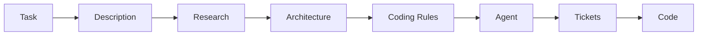

# SDDRush — Spec‑Driven Development, fast

Minimal, pragmatic toolkit to kick off Spec‑Driven Development (SDD) with prompt templates and tiny scripts. Keep the core simple, automate the boring parts.

## Why
- Faster setup for any task with a consistent SDD flow
- High‑quality prompts (task solver, research, architect, coding rules, agent)
- Works with your favorite CLI agents (Q, Qwen, Codex, Gemini, Cursor)

## Flow

## Quick Start (recommended: single‑project mode)
- Initialize inside a project directory
  - `bash bin/sdd-init /path/to/project --stack "Node.js/Web Audio API" --domain audio`
- Write the description
  - Edit `/path/to/project/.sdd/project.md`
- Render prompts
  - `python bin/sdd-prompts /path/to/project`
- Run in your agent
  - `00_task_solver` or `00_solution_ideation` → (optional) save plan
  - `01_research` → paste to `.sdd/best_practices.md`
  - Re‑render → `02_architect` → paste to `.sdd/architect.md` (includes Backlog tickets)
  - `03_coding_rules` → paste to `.sdd/coding_rules.md`
  - Re‑render → `04_agent` → implement tickets in `backlog/open/`

## Templates
- `templates/task_solver_template.md` — solution designer with MCDM step
- `templates/solution_ideation_template.md` — alternatives→recommendation, verification
- `templates/research_template.md` — evidence‑based best practices ({{YEAR}})
- `templates/architect_template.md` — ADRs, SLOs, and MCDM table for major choices
- `templates/coding_rules_template.md` — concrete commands/configs
- `templates/agent_template.md` — implementing agent with inline context
- `templates/adapt_prompt.md` — 1:1 prompt rewrites between stacks/domains

## Notes
- You can re‑run `bin/sdd-prompts` anytime — it inlines latest context into the agent prompt.
- Web search stays manual by design; paste results into files.

## Example Project
A great example of SDD in action is the [TR-808 Synth](https://github.com/chernistry/tr808ish) project - a drum sequencer created with AI in about 30 minutes using the SDD methodology. This project demonstrates how SDD enables rapid development of functional applications with quality code, comprehensive testing, and proper architecture.

## License
MIT

## Tags
spec-driven-development, prompt-engineering, ai-agents, software-architecture, templates, research, best-practices, automation, cli-tools, llm, developer-tools, engineering-workflows, multi-agent-systems, decision-making, mcdm
